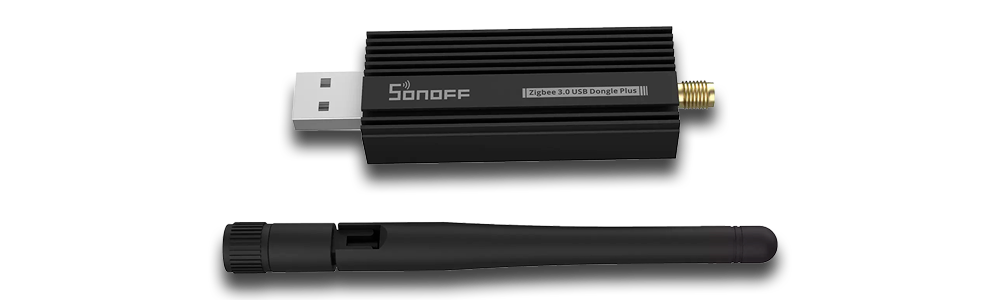

# Home automation

## Disclaimer

Smart homes are changing the way we live, offering more control, comfort, and security. With tools like Home Assistant, you can automate daily tasks, monitor your environment, and keep your home safe and energy-efficient.

In this guide, I’ll show you how to build a flexible, scalable smart home system using a Raspberry Pi, Home Assistant, a Zigbee dongle, and various sensors. It’s not the only way to do it, but it works well and can be customized to fit your needs.

You don’t even need a house or apartment to get started—the goal is to make any space smarter, wherever you are! 🤣

Got ideas or suggestions? I’d love to hear them!

> "Don’t fear the machines. Fear what they do to people." \
> — Ray Bradbury, Fahrenheit 451

## Hardware

| **Item**                                                   | **Description**                                 |
|------------------------------------------------------------|-------------------------------------------------|
| Raspberry Pi 4B / 8GB RAM / 250GB SSD                      | A powerful single-board computer with ample RAM and storage. |
| [Argon ONE M.2 Case for Raspberry Pi 4](https://argon40.com/en-de/products/argon-one-m-2-case-for-raspberry-pi-4) | A high-quality case for Raspberry Pi 4 with M.2 SSD support and cooling. |
| [SONOFF ZigBee 3.0 USB Dongle Plus](https://www.amazon.pl/SONOFF-zewn%C4%99trznej-Uniwersalna-preinstalowana-koordynacja/dp/B09KXTCMSC/) | A ZigBee USB dongle for connecting ZigBee devices to your home automation setup. |
| [UPS HAT (E) for Raspberry Pi](https://www.waveshare.com/product/ups-hat-e.htm) | Uninterruptible Power Supply (UPS) HAT to provide backup power for the Raspberry Pi. |
| Huawei Mobile Broadband 3G Modem E1552                     | A 3G USB modem for mobile internet connectivity. |
| Various Chinese sensors | A range of sensors and accessories from Xiaomi, including motion sensors and cameras. |

### SONOFF ZigBee 3.0 USB Dongle Plus

As part of our Home Assistant setup on the Raspberry Pi, the SONOFF ZigBee 3.0 USB Dongle Plus serves as the Zigbee coordinator, enabling seamless communication between Home Assistant and a wide range of Zigbee devices. This USB dongle supports the Zigbee 3.0 protocol, offering reliable connectivity, broad device compatibility, and extended range thanks to its built-in antenna. It works perfectly with Zigbee2MQTT, allowing for easy integration and management of smart sensors, switches, lights, and more within your smart home environment.

## Software

 * Ubuntu 24.04 LTS
 * Docker

## Home Assistant

| Feature               | HA OS | Container | Core | Supervised |
|-----------------------|-------|-----------|------|------------|
| Automation            | ✓     | ✓         | ✓    | ✓          |
| Dashboard             | ✓     | ✓         | ✓    | ✓          |
| Integrations          | ✓     | ✓         | ✓    | ✓          |
| Add-ons               | ✓     | ✓         | ✓    | ✓          |
| Diagrams              | ✓     | ✓         | ✓    | ✓          |
| Quick Update          | ✓     | ✓         |      |            |
| Backups               | ✓     | ✓         | ✓    | ✓          |

## Zigbee2MQTT

Zigbee2MQTT is an open-source project that lets Zigbee devices talk to MQTT brokers, making them compatible with Home Assistant and other automation platforms. Compared to Home Assistant’s built-in Zigbee integration, Zigbee2MQTT offers:

 * Wider device compatibility
 * Frequent updates
 * Strong community support

This makes it a more flexible and reliable choice for managing Zigbee devices in your smart home. That’s why we’ll be using Zigbee2MQTT in our setup!
